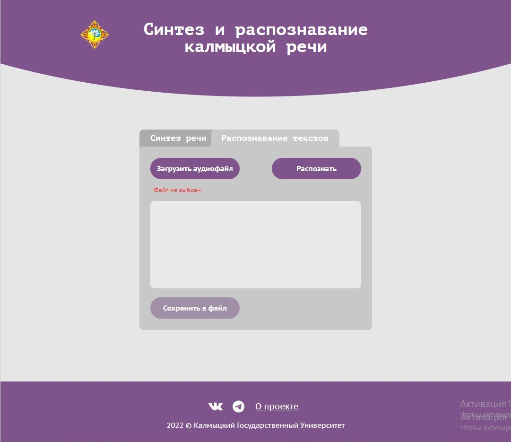

# Инструмент синтеза и распознавания калмыцкой речи

> Синтез и распознавание калмыцкой речи.

## Описание

- Проект создан в образовательных целях по заказу Калмыцкого Государственного Университета им Б.Б.Городовикова



## Функциональность

- Синтез голоса из текста на калмыцком языке,
  - набранного вручную
  - загруженного из файла
- Выбор голоса синтеза - мужской или женский
- Скачивание синтезированного файла в формате wav
- Возможность прослушать получившийся файл в плеере
- Распознавание речи на калмыцком языке из пользовательского файла в формате wav
- Возможность сохранить распознанный фрагмент в текстовый файл и скачать в формате txt

## Установка

Чтобы запустить проект локально, используйте npm (CLI Node.js):

```
$ cd ../frontend
$ npm install
$ npm start
```

## Производственная сборка

Для финальной сборки проекта используйте npm (CLI Node.js):

```
$ npm run build
```
